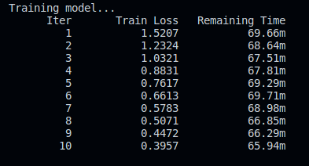

# ROB310-HCI-Project

## Project Description
This project is a sign language interpreter. It uses a camera to detect the hand gestures and then translates them into text. The text will then spoken out loud using a text-to-speech engine. The project is implemented using Python, OpenCV, MediaPipe and SKLearn.

## Installation
To install the project, you will need to install the following dependencies:
- Python 3.7
- OpenCV
- MediaPipe
- SKLearn

## Usage
- First run the DataGathering.py file to gather the data for the training of the model. This will be done by a user signing the letters of the alphabet and the data will be saved in a pickle file.

- Then run the TrainDataset.py file to train the model using the data gathered in the previous step. The model will be saved in a pickle file. 

- Finally run the DetectSign.py file to start the sign language interpreter. The camera will start and the user can start signing. The detected sign will be displayed on the screen and the text will be spoken out loud.

