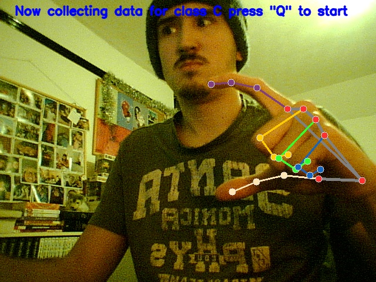
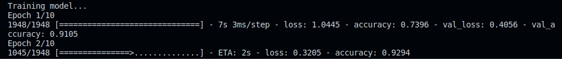
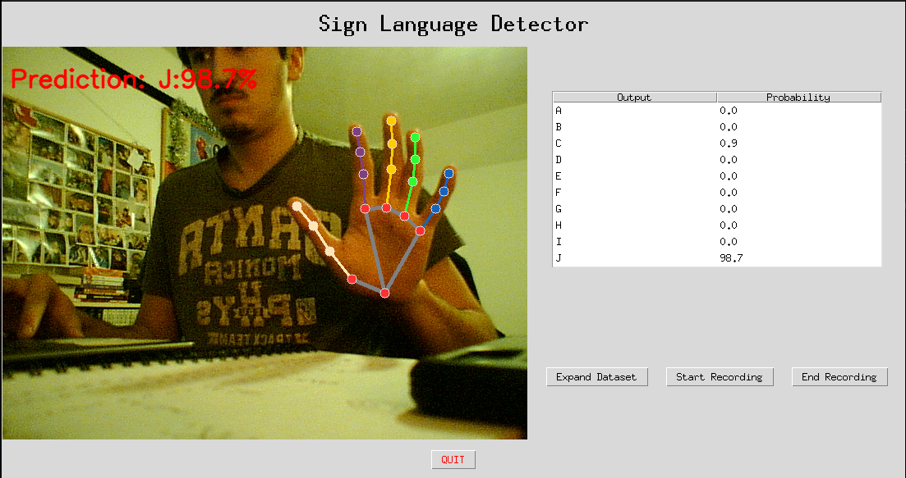
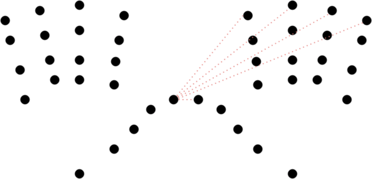

# ROB310-HCI-Project

## Project Description
This project is a sign language interpreter. It uses a camera to detect the hand gestures and then translates them into text. The text will then spoken out loud using a text-to-speech engine. The project is implemented using Python, OpenCV, MediaPipe, Sci-Kit Learn and TensorFlow. The idea behind the project is to help people with hearing disabilities communicate with people who do not know sign language. The project is also a great way to learn sign language as the user can see the sign they are making and the corresponding text. The project is also a great way to learn about machine learning and computer vision.

## Project Structure
The project is divided into 4 main files:
- DataGathering.py: This file is used to gather the data for the training of the model. This will be done by a user signing the letters of the alphabet and the data will be saved in a pickle file.
- TipDistance.py: This file is used to gather information on the distances between the tips of fingers and other points on both hands. This is a vital step as it makes the whole thing work properly. The data will be saved in a pickle file.
- TrainDatasetTF.py: This file is used to train the model using the data gathered in the previous step. The model will be saved in 2 files `model.h5` and `modeldata.pickle`. The 'modeldata.pickle' file contains the data used to train the model and the `model.h5` file contains the trained model.
- DetectSignTF.py: This file is used to start the sign language interpreter. The camera will start and the user can start signing. The detected sign will be displayed on the screen and the text will be spoken out loud.

## Installation
To install the project, you will need to install the following dependencies:
### Python:
- Python 3.7
- OpenCV
- MediaPipe
- SKLearn
- Tensorflow
- Keras
- Pickle
- Numpy
- gtts

### Other:
- A webcam
- mpg123 (for linux users, to play the audio files)

## Usage
- First run the DataGathering.py file to gather the data for the training of the model. This will be done by a user signing the letters of the alphabet and the data will be saved in a pickle file.
    - The user will see a window with the camera feed saying which letter will be recorded next and also showing the mediapipe hand landmarks to help the user position their hand correctly.
    - The user will then press the Q key to start recording the data for the letter. The user will a quick countdown and then the recording will start.
    - The user will then sign the letter and the data will be recorded.
    - The user will then repeat the process for all the letters of the alphabet.

- Then run the TipDistance.py file to gather information on the distances between the tips of fingers and other points on both hands. This is a vital step as it makes the whole thing work properly. The data will be saved in a pickle file.

- Then run the TrainDatasetTF.py file to train the model using the data gathered in the previous step. The model will be saved in 2 files `model.h5` and `modeldata.pickle`. The 'modeldata.pickle' file contains the data used to train the model and the `model.h5` file contains the trained model. The terminal will display the accuracy of the model so if it is not high enough, the user can go back to the previous step and gather more data or change the parameters of the model for example the number of hidden layers or the number of epochs.

- Finally run the DetectSignTF.py file to start the sign language interpreter. The camera will start and the user can start signing. The detected sign will be displayed on the screen and the text will be spoken out loud.
    - The user will see a window with the camera feed and the detected sign.
    - The user will also see a table with possible detected signs and the confidence of the model in the predictions.
    - The user will also see 3 buttons allowing you to record video of the interpreter.

## How it works

- The DataGathering.py file uses the MediaPipe library to detect the hand landmarks and then saves the x and y coordinates of the landmarks in a pickle file. The file also saves the letter that was signed. This is the basis of the dataset however we can't get enough information from just the x and y coordinates of the landmarks. This is why we need to calculate the distances between the tips of the fingers and other points on the hand as shown in the image above though its done for every finger not just the thumb. This data makes the whole thing more accurate as alot of sign language alphabet is about touching fingers together.

## Cybersecurity

| Vulnerability | Description | Mitigation |
| ------------- | ----------- | ---------- |
| Storing of data for training | The data used to train the model is stored in a pickle file. This file can be accessed by anyone with access to the computer. | The data is stored in a pickle file which is not encrypted. This means that anyone with access to the computer can access the data. This is not a big issue as the data is just the x and y coordinates of the hand landmarks and the letter that was signed. This data is not personal and can't be used to identify anyone. |
| Opensource project | The project is opensource which means that anyone can access the code and see how it works. | This is not a big issue as the project is not meant to be used in a secure environment. The project is meant to be used by people who want to learn sign language or by people who want to communicate with people who know sign language. |
| Opensource editing | The project is opensource which means that anyone can edit the code and change how it works. | This is not a big issue as I can select what code is incorporated into the project. This means that I can make sure that the code is safe and secure. |
| Opensource dependencies | The project uses opensource dependencies which means that anyone can access the code and see how it works. | This is not a big issue as the dependencies are well known and trusted. This means that they are safe and secure. |
| My images in the README.md file | The images in the README.md file are stored in the repository. This means that anyone with access to the repository can access the images. | I gave myself permission to use those images. |

## Future Development

| &#10004; | Feature | Description |
| --- | ------- | ----------- |
| | Moving signs | The ability to detect signs that are moving, for example J |
| | Word signs | The ability to detect full words, for example Hello and thank you, this would rely on the moving signs feature, and would probably require some torso detection due to using the whole body to make the sign |

## Credits
- [MediaPipe](https://google.github.io/mediapipe/)
- [OpenCV](https://opencv.org/)
- [Sci-Kit Learn](https://scikit-learn.org/stable/)
- [TensorFlow](https://www.tensorflow.org/)
- [Keras](https://keras.io/)
- [Pickle](https://docs.python.org/3/library/pickle.html)
- [Numpy](https://numpy.org/)
- [gtts](https://pypi.org/project/gTTS/)
- [mpg123](https://www.mpg123.de/)
- [Sign Language Alphabet](https://deafaction.org/bsl-courses/learn-the-bsl-alphabet/)
- [Me](https://github.falmouth.ac.uk/JA244121)
